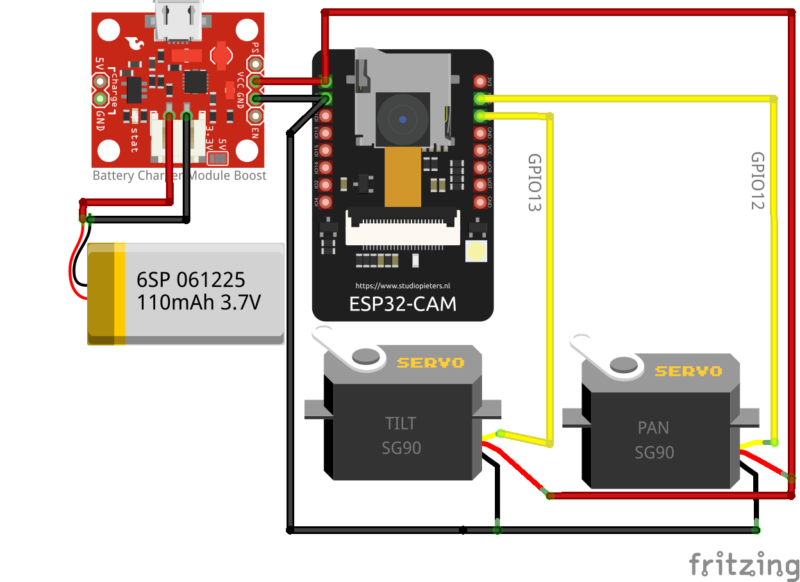

# esp32cam



## Esphome

Clone the project and change the content of the secrets.yaml file to be able to connect to a local wifi network before flashing the esp32 :

First time flash with FTDI Mini USB to TTL Serial UART Adapter Module :
```sudo docker run --rm -v "${PWD}":/config --device=/dev/ttyUSB0 -it esphome/esphome run camera.yaml```

Over the air flash :
```sudo docker run --rm -v "${PWD}":/config --network=host  -it esphome/esphome run camera.yaml```


## Fritzing schematics

```sudo docker run -ti --rm -e DISPLAY=$DISPLAY -v /tmp/.X11-unix:/tmp/.X11-unix -v "${PWD}":/home/fritzing/docs jerivas/fritzing```


